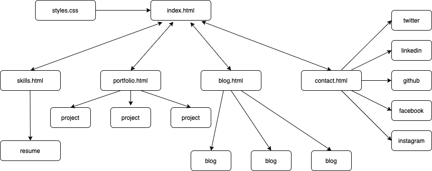
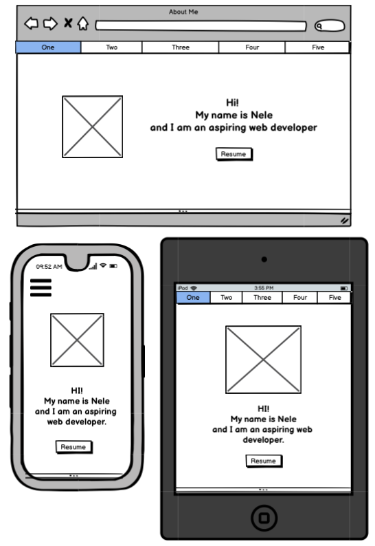
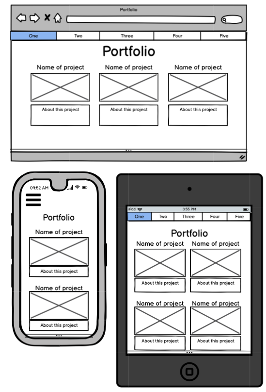
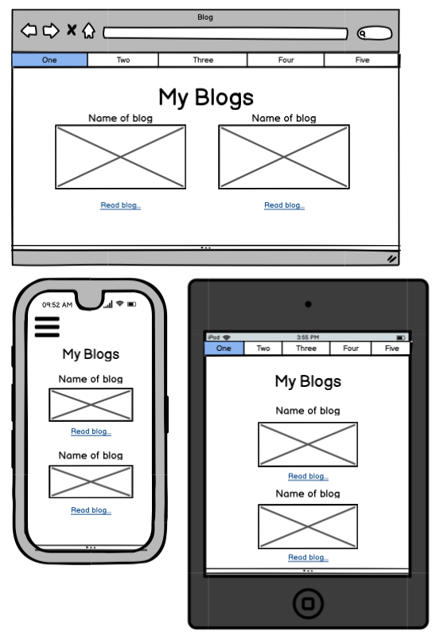
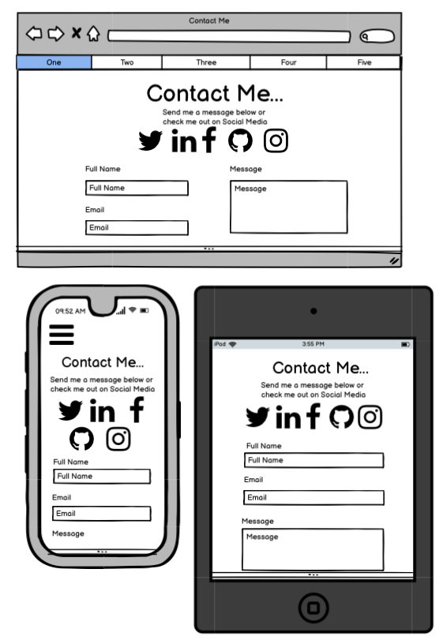

A link (URL) to your published portfolio website
A link to your Portfolio Ed Workspace
Description of your portfolio website, including,
Purpose
Functionality / features
Sitemap
Screenshots
Target audience
Tech stack (e.g. html, css, deployment platform, etc)

GitHub repo link:
Deployable Site: 
Link to Ed Worspace

## Purpose for this website:

This portfolio was devloped as a way to showcase my skills as a developer and to show work I have done. It contains a contact me form, information about me, my blog page and links to my social media.

## Functionality / features

The design is responsive and accesablble. It features a fixed navigation bar, css animations and a contact form.

## Sitemap

## Screenshots

### Wireframes

### Screenshots of website

## Target Audience

My portfolio was created to show any future employees or for a company who needs a developer

# Tech Stack

- html
- css
- icons imported from font awesome