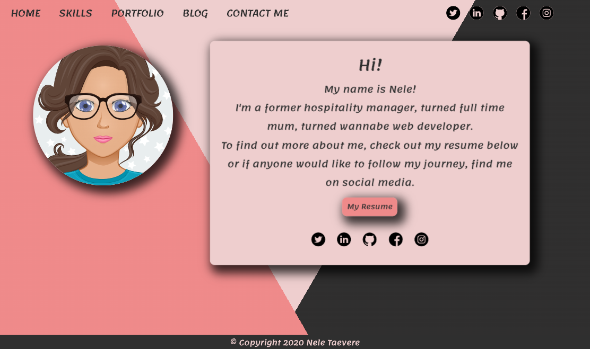
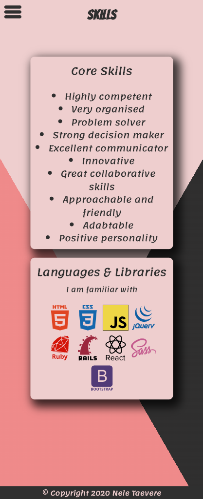
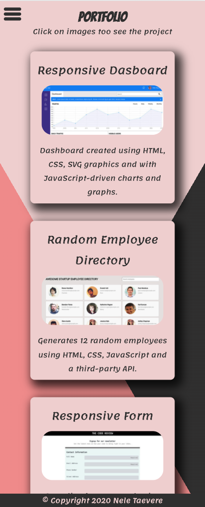

- GitHub repo link: [click here for Github repo](https://taeverenele.github.io/Nele_Portfolio_2020/)

- Link to Ed Worspace: 

# Purpose for this website:

This portfolio was devloped as a way to showcase my talents, coding experience and skills as a developer. 
Website is targeted towards potential future employers looking to expand their dev team.

# Functionality / features

The design is responsive and accessible layed out on multiple pages:

- index page, an intoduction to who I am and link to my resume
- skills page, demonstrates my core skills and technical abilities
- portfolio page, showcases my coding experience
- blog page, displays my writing and blogging skill
- contact me page, contains a form for viewers to get in touch

## Navigation

On mobile view the navigation is hidden until hamburger menu button is pressed. Once pressed, everything on the page is moved down to allow room for the navigation buttons and social media icons.

Tablet view has visible navigation layed out in a row with social links centered underneath.

Desktop view has all navigation links and social icons in one line at the top of the page at either end of the screen.

## Header

On different pages the header components displays different content. On index.html it contains the avatar image, but on other pages the title and a paragraph for the page you are on.

## Main

Main component on all pages has the main content of the page, such as a short description of me, skills, projects, blogs or a form to get in touch.

## Footer

At the bottom of every page is fixed to the screen and displays the copyright message.

# Sitemap

## Screenshots

### Wireframes

### Screenshots of website

# Target Audience

My portfolio was created to show any future employees or for a company who needs a developer

# Tech Stack

The website was built using HTML, CSS, a little bit of JavaScript to make the hamburger menu functional and Google Fonts to add a fun font style.

For the purpose of this assignment, the website is deployed on Github Pages.

