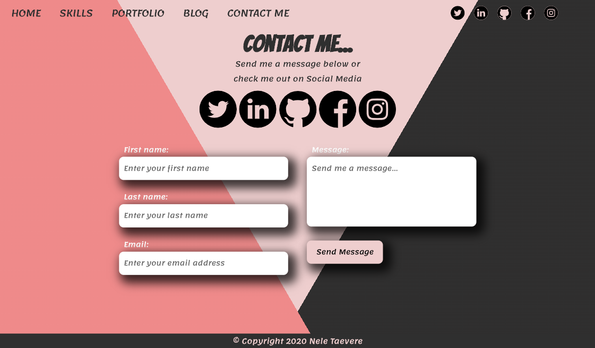
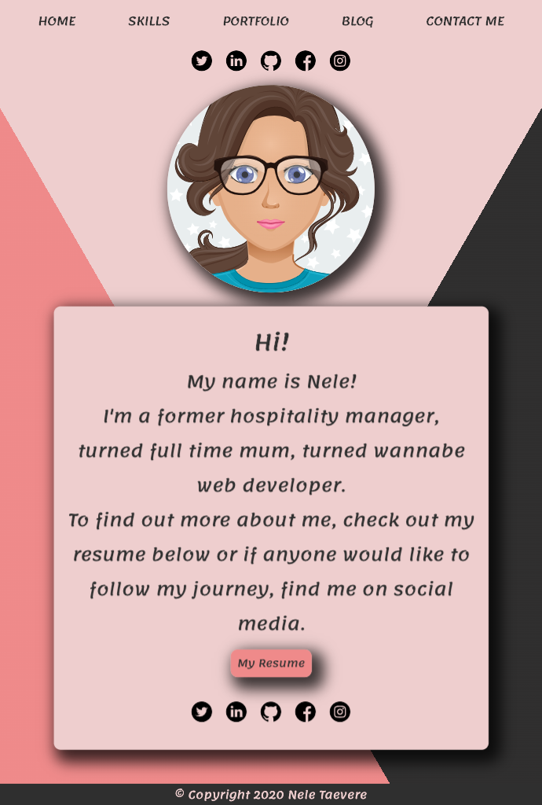
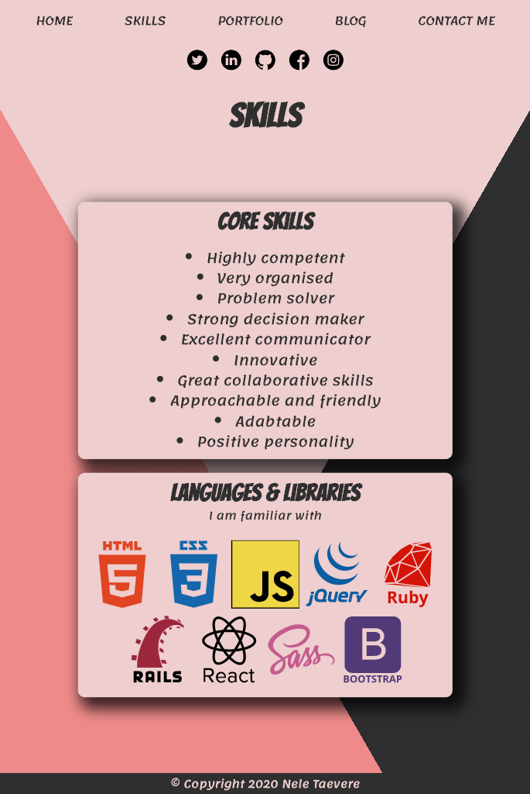
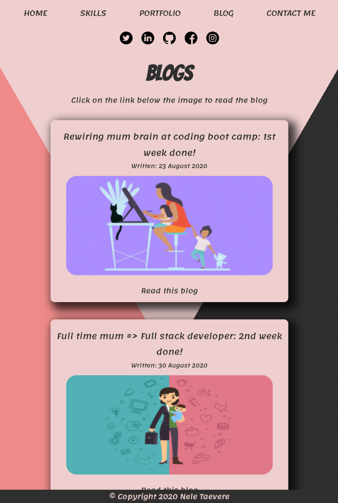

A link (URL) to your published portfolio website
A link to your Portfolio Ed Workspace
Description of your portfolio website, including,
Purpose
Functionality / features
Sitemap
Screenshots
Target audience
Tech stack (e.g. html, css, deployment platform, etc)

GitHub repo link:
Deployable Site: 
Link to Ed Worspace

## Purpose for this website:

This portfolio was devloped as a way to showcase my talents, coding experience and skills as a developer. 
It is targeted towards potential future employers looking to expand their dev team.

## Functionality / features

The design is responsive and accessible.

My webpage consists of:

- index page, an intoduction to who I am and link to my resume
- skills page, demonstrates my core skills and technical abilities
- portfolio page, showcases my coding experience
- blog page, displays my writing and blogging skill
- contact me page, contains a form for viewers to get in touch

## Sitemap

## Screenshots

### Wireframes

### Screenshots of website

## Target Audience

My portfolio was created to show any future employees or for a company who needs a developer

# Tech Stack

- html
- css
- icons imported from font awesome